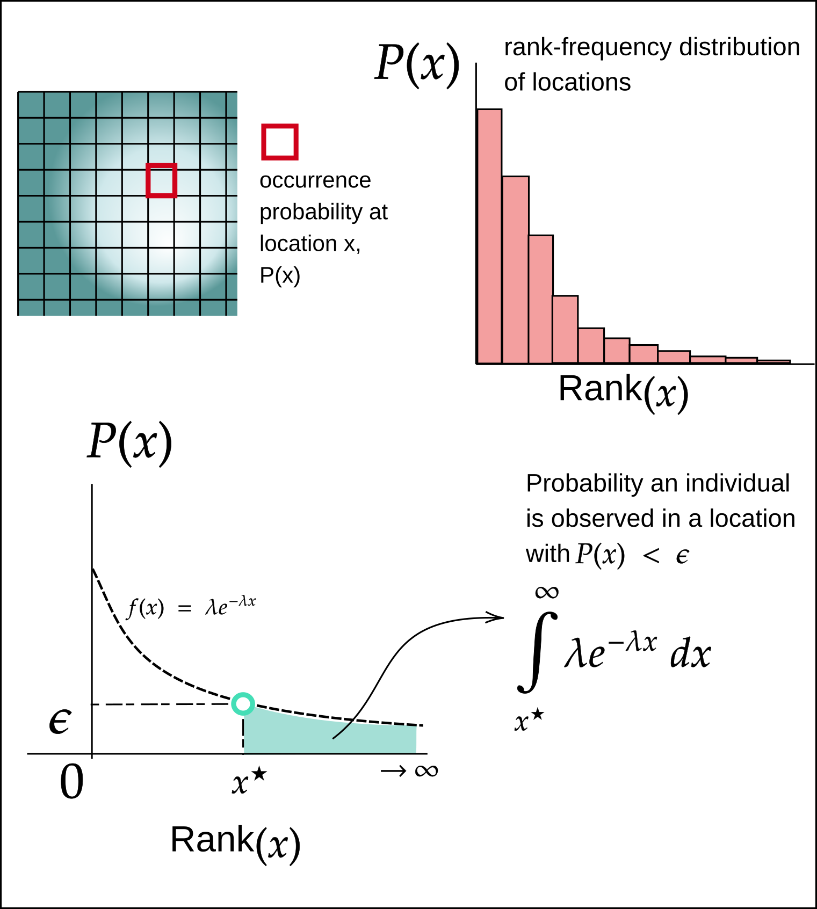

> Nature does not prepare distributions, only states.
>
> ET Jaynes

> I would warn you that I do not attribute to nature either beauty or deformity,
> order or confusion. Only in relation to our imagination can things be called
> beautiful or ugly, well-ordered or confused
>
> a common misquote of _Baruch Spinoza_, assembled from translated parts
> of his _Ethics (Part I)_  

Species do not _actually_ have distributions. This may seem a radical claim,
given the rise of species distribution modeling as both a field of study and
imperative for ecosystem management over the last several decades. But consider
that species are composed of discrete objects---individual organisms that occupy
points in space and which move through time. The location of every individual
organism of a particular species at a particular time is an observable value,
which we could feasibly write down. In most cases the number of individuals of a
species becomes large enough that this is no longer practical.

A distribution is not some inherent property of a given species, but a
conceptual framework that we invoke because we know that sampling of species
locations is incomplete, and in most contexts these location of the individuals
observed in this sample will change as species move after they are observed. The
goal of a species distribution model (SDM) is instead to take a set of
coordinates of observed occurrence of a species $\mathbf{O} = \{\vec{o}_1,
\vec{o}_2, \dots\}$ and to best describe a distribution $D$ such that the true
coordinates of the individuals of that species, denoted $\mathbf{X} =
\{\vec{x}_1, \vec{x}_2, \dots\}$ are likely to have been drawn from this
distribution $D$. Note that typically $|O| \ll |X|$, as is the reason we don't
try to measure the location every individual in the first place (that being
said, for charismatic megafauna that are nearly extinct, this _is_ what we do,
precisely because it is feasible). Yet this should not be mistaken for the
distribution $D$ being an inherent but latent "property" of species.

Many approaches have been taken to design SDMs, but almost universally the
output of an SDM is a raster, where the value of each location/cell $i$, denoted
$p_i$, forms a distribution as $\sum_{i} p(i) = 1$. The value of a cell is often
referred to in plain language as "occurrence probability". But what is meant by
this?---is it the probability conditional on observing an individual that it
will be observed at that location? Or is it the probability that an observer
would find an individual of this species at location if they "look hard enough"?

This semantic confusion is a by-product of using a distribution as a tool to
model something that is discrete --- the finite number of individuals of a
species that exist across space. Regardless of the paradigm used to design the
model predicting occurrence probability, the framing of _occurrence probability_
as existing per unit space is fundamentally a _frequentist_ view of probability,
as this does not consider that a finite number of samples from this spatial
distribution are unlikely to produce . A more appropriate way to view this would
be the probability you observe an individual at a location $\vec{x}$ as
conditional on there being $N$ total individuals of a given species across the
entire spatial domain,  $p = P(\vec{x} | N)$--- we illustrate this using a
"sandbox" SDM in the next section.

# An illustration

What is the value for which $p(x)$ is non-zero,
but _effectively_ $0$?

The goal in this section is to determine how the abundance of a species is $N$
effects the meaning of the occurrence probability

species all occur in cells of the raster with a probability-value $A_{xy}$ that
is greater than some threshold. Dare I say it, but this section may
contain multiple integrals.

Consider an SDM where the probability of occurrence of a species is given for
each location $x$ is given by $P(x)$. Assume the rank-frequency distribution
values of $P(x)$ follow an exponential distribution, with pdf $f(x) = \lambda
e^{-\lambda x}$. What is the probability that for $N$ observations of this
species, that all of them occur in cells above some threshold value $\epsilon$?

{#fig:density}

We start by determining what the probability of a single observation happening _below_ $\epsilon$. Assume $O \sim \text{Exp}(\lambda)$. Then

$$P(O < \epsilon) = \int_{x^\star}^\infty f(x) dx$$

From this we see $\epsilon = \lambda e^{-\lambda x^\star}$ which implies

$$\implies x^\star = \frac{1}{\lambda}\ln \bigg(\frac{\lambda}{\epsilon} \bigg)$$

substituting into first line and integrating, because the exponential
distribution is nice this cosmic gumbo now reduces to

$$P(O < \epsilon) = \frac{\epsilon}{\lambda}$$

Next, we take this result and plug it back into our original question, which is
the probability that none of $N$ observations occur below $\epsilon$ which we
can express as

$P(N \notin x_{\leq \epsilon}) = \bigg(1 - \frac{\epsilon}{\lambda}\bigg)^N$

which looks like

{#fig:neato}

As the mass of probability becomes more "evenly spread" across the entire
spatial domain, the probability of all individuals being observed in locations
with $p > \epsilon$ goes down, as there are more cells with $p \leq \epsilon$.

## Test if continuous approx of space holds for various raster sizes

In this section we risk falling into the mind-projection fallacy again, as in
reality, an SDM is described by a finite $n$x$m$ raster where the values of the
raster at an index $(x,y)$ and does not "truly" follow an exponential
distribution as assumed above.

# An example: use real data and make and SDM, and report different maps based on simulating occurrence

# Conc

Jaynes on the mind-projection fallacy:

>  In studying probability theory, it was vaguely troubling to see reference to
>  "Gaussian random variables", or "stochastic processes", or "stationary
>  time-series", or "disorder", as if the property of being Gaussian, random,
>  stochastic, stationary, or disorderly is a real property, like the property
>  of possessing mass or length, existing in Nature...
> As soon as the error
>  had a definite name and description, it was much easier to recognize. Once
>  one has grasped the idea, one sees the Mind Projection Fallacy everywhere;
>  what we have been taught as deep wisdom, is stripped of its pretensions and
>  seen to be instead a foolish non sequitur. The error occurs in two
>  complementary forms, which we might indicate thus:
>
> A): My own imagination -> Real property of Nature
>
> B): My own ignorance -> Nature is indeterminate

"Our own ignorance implies nature is indeterminate". This is why we build SDMs.
Clearly the locations of the individuals of a species at any point in time is a
measurable property of the world for which there cannot be more than one
realized value. But we cannot sample this entire thing, so we take a subset of
it and aim to estimate the this latent "species distribution" in order to
predict  where one might observe a species.

This pattern is common in the history of science. To develop on an example
raised by Jaynes---quantum mechanics has an object that much like a species
distribution model: the wave function $\psi$ describing the probability of
observing a particle across space. A misinterpretation of the wave function,
according to Jaynes, is that often one assumes that the distribution of where
observers see a particle is an inherent property of that particle, rather than
being a construct of human imagination created to make predictions based on the
information we have observed about that particle. The most (in)famous example of
this is likely Schrodinger's cat: often presented as the lens that the cat is
somehow _both_ alive and dead at the same time--- a quintessential of the
mind-projection fallacy as described above. The state of the external world
cannot be assumed indeterminate for the sole reason that we lack the information
to fully describe it. This is equivalent to saying if one is in New York, then
for oneself London becomes a multiverse of the possible worlds which are only
realized upon one's return.

Is "probability" is a fixed property of nature rather than an abstraction used
describe what we can say about a system given a set of information? me,
personally, i don't know.

# References
